# AI Telemetry — User Manual

> **App**: AI Telemetry for Microsoft Dynamics 365 Business Central  
> **Publisher**: bydynamics  
> **Version**: 28.0  

---

## Table of Contents

1. [Introduction](#1-introduction)
2. [Installation & Setup](#2-installation--setup)
   - [2.1 Installing from AppSource](#21-installing-from-appsource)
   - [2.2 Setup Wizard (Recommended)](#22-setup-wizard-recommended)
   - [2.3 Configuring Application Insights Connection](#23-configuring-application-insights-connection)
   - [2.4 Authentication Methods](#24-authentication-methods)
   - [2.5 Copilot Setup (Optional)](#25-copilot-setup-optional)
3. [Permission Sets](#3-permission-sets)
4. [Telemetry Queries](#4-telemetry-queries)
   - [4.1 The Query List](#41-the-query-list)
   - [4.2 Query Categories](#42-query-categories)
   - [4.3 Creating a New Query](#43-creating-a-new-query)
   - [4.4 The Query Card & KQL Editor](#44-the-query-card--kql-editor)
   - [4.5 Activating and Deactivating Queries](#45-activating-and-deactivating-queries)
5. [Executing Queries](#5-executing-queries)
   - [5.1 Running a Simple Query](#51-running-a-simple-query)
   - [5.2 Running a Parameterized Query](#52-running-a-parameterized-query)
6. [Query Results](#6-query-results)
   - [6.1 Results Grid](#61-results-grid)
   - [6.2 Viewing Row Details](#62-viewing-row-details)
   - [6.3 Open in Azure Portal](#63-open-in-azure-portal)
7. [Query Parameters](#7-query-parameters)
   - [7.1 Defining Parameters](#71-defining-parameters)
   - [7.2 Parameter Data Types](#72-parameter-data-types)
   - [7.3 Lookup Values](#73-lookup-values)
   - [7.4 Fixed Parameters](#74-fixed-parameters)
   - [7.5 Detecting Parameters Automatically](#75-detecting-parameters-automatically)
8. [Query Templates](#8-query-templates)
   - [8.1 Initializing Templates](#81-initializing-templates)
   - [8.2 Available Templates](#82-available-templates)
9. [Import & Export](#9-import--export)
   - [9.1 Exporting Queries](#91-exporting-queries)
   - [9.2 Importing Queries](#92-importing-queries)
10. [Query Execution Log](#10-query-execution-log)
    - [10.1 Viewing the Log](#101-viewing-the-log)
    - [10.2 Re-executing from the Log](#102-re-executing-from-the-log)
11. [Copilot - AI-Powered Query Generation](#11-copilot---ai-powered-query-generation)
    - [11.1 Prerequisites](#111-prerequisites)
    - [11.2 Generating a New Query](#112-generating-a-new-query)
    - [11.3 Refining an Existing Query](#113-refining-an-existing-query)
    - [11.4 AI Parameter Detection](#114-ai-parameter-detection)
    - [11.5 Prompt Guide](#115-prompt-guide)
    - [11.6 Self-Healing Queries](#116-self-healing-queries)
    - [11.7 Custom Azure OpenAI Deployment](#117-custom-azure-openai-deployment)
12. [Troubleshooting](#12-troubleshooting)
13. [Reference](#13-reference)
    - [13.1 Pages Overview](#131-pages-overview)
    - [13.2 Keyboard Shortcuts](#132-keyboard-shortcuts)

---

## 1. Introduction

AI Telemetry brings Azure Application Insights telemetry analysis directly into Business Central. Instead of switching to the Azure Portal and writing KQL manually, you can:

- **Query telemetry** using a built-in KQL code editor with syntax highlighting.
- **Use Copilot** to generate or refine KQL queries from natural language descriptions.
- **Manage a library** of saved queries organized by category.
- **Parameterize queries** so users can run them without modifying KQL.
- **View results** in a dynamic grid inside Business Central.
- **Track execution history** with a full audit log.

The app targets Business Central administrators, consultants, and ISVs who need to monitor environment health, investigate errors, and analyze performance — without leaving their daily workspace.

> **Quick start**: Watch the [interactive demo](https://bydynamics.storylane.io/share/en6odgbhtm6j) (< 2 minutes) to see AI Telemetry in action.

---

## 2. Installation & Setup

### 2.1 Installing from AppSource

1. In Business Central, go to **Extension Management**.
2. Search for **AI Telemetry** by bydynamics.
3. Choose **Install** and follow the prompts.

Alternatively, install from [Microsoft AppSource](https://appsource.microsoft.com) directly.

### 2.2 Setup Wizard (Recommended)

The **AI Telemetry Setup Wizard** guides you through the complete configuration in a single flow. It runs automatically after first install, or you can launch it manually:

- Search for **AI Telemetry Setup Wizard** (Alt+Q), or
- Open **Assisted Setup** and find it under Administration.

The wizard consists of the following steps:

**Step 1 — Welcome**
Overview of what you'll need: Application Insights App ID, App Registration credentials (Client ID, Client Secret), and your Azure AD Tenant ID.

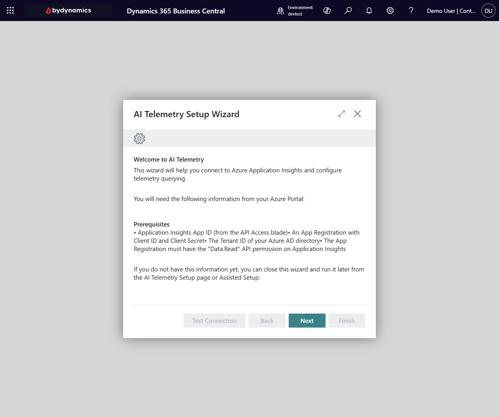

**Step 2 — Application Insights Connection**
Enter your credentials and click **Test Connection** to verify. The connection status appears inline after testing.

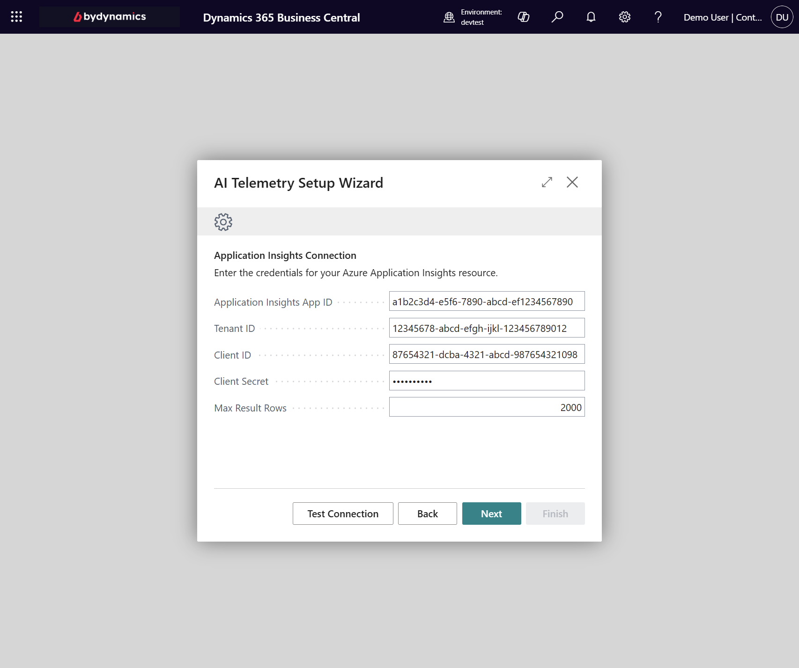

**Step 3 — Copilot Configuration (Optional)**
Configure a custom Azure OpenAI deployment for sandbox environments. Leave empty to use the Microsoft-managed deployment in production. Click **Test Connection** to verify custom settings.

**Step 4 — Query Templates**
Choose whether to initialize pre-built query templates. This step is skipped if templates already exist (they are created automatically on first install).

**Step 5 — User Permissions**
Assign permission levels to users directly from the wizard:
- **Reader** — View and execute queries
- **Editor** — Manage queries and use Copilot
- **Admin** — Full access including Copilot configuration

**Step 6 — Summary & Finish**
Review your configuration and click **Finish** to save all settings.

> **Note:** No changes are saved until you click Finish. You can close the wizard at any time without affecting your current configuration.

### 2.3 Configuring Application Insights Connection

If you prefer manual setup instead of the wizard:

1. Use the search bar (Alt+Q) and search for **AI Telemetry Setup**.
2. Enter your **Application Insights App ID**.
   - Find this in the Azure Portal → your Application Insights resource → API Access → Application ID.
3. Enter the **Tenant ID**, **Client ID**, and **Client Secret** (see [2.4 Authentication Methods](#24-authentication-methods)).
4. Set the **Max Result Rows** (default: 1000, max: 10,000).
5. Click **Test App Insights Connection** to verify.

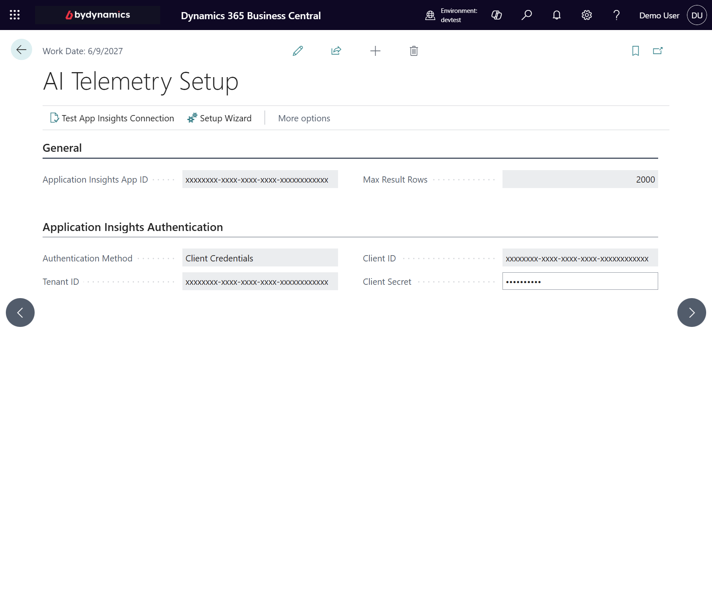

### 2.4 Authentication Methods

The app supports one authentication method:

| Method | Fields Required | When to Use |
|--------|----------------|-------------|
| **Client Credentials** (OAuth) | Tenant ID, Client ID, Client Secret | Recommended. Uses an Entra ID app registration with Reader access to Application Insights. |

**Setting up Client Credentials:**

1. In the Azure Portal, create an **App Registration** (or use an existing one).
2. Under **API Permissions**, grant `Application.Read` on your Application Insights resource (or assign the **Reader** role on the resource via IAM).
3. Create a **Client Secret** and copy the value.
4. In AI Telemetry Setup, enter:
   - **Tenant ID**: Your Azure AD / Entra tenant ID
   - **Client ID**: The app registration's Application (client) ID
   - **Client Secret**: The secret value (stored encrypted in Isolated Storage)

If the test fails, verify:
- The App ID is correct (not the Instrumentation Key).
- The app registration has Reader access to the Application Insights resource.
- The Client Secret has not expired.

### 2.5 Copilot Setup (Optional)

Copilot features require:
- A **SaaS** (online) Business Central environment.
- **Copilot & AI capabilities** enabled in the Admin Center.

**For production environments:** The app uses Microsoft-managed Azure OpenAI resources automatically. No additional setup is needed.

**For sandbox environments:** You must configure a custom Azure OpenAI deployment:

1. Search for **AI Telemetry Copilot Setup** or configure via the Setup Wizard (Step 3).
2. Enter your **Custom AOAI Endpoint** (must start with `https://`).
3. Enter the **Deployment Name** (e.g., `gpt-4o`).
4. Enter the **API Key**.
5. Optionally specify a **Content Filter** name.
6. Click **Test Connection** to verify.

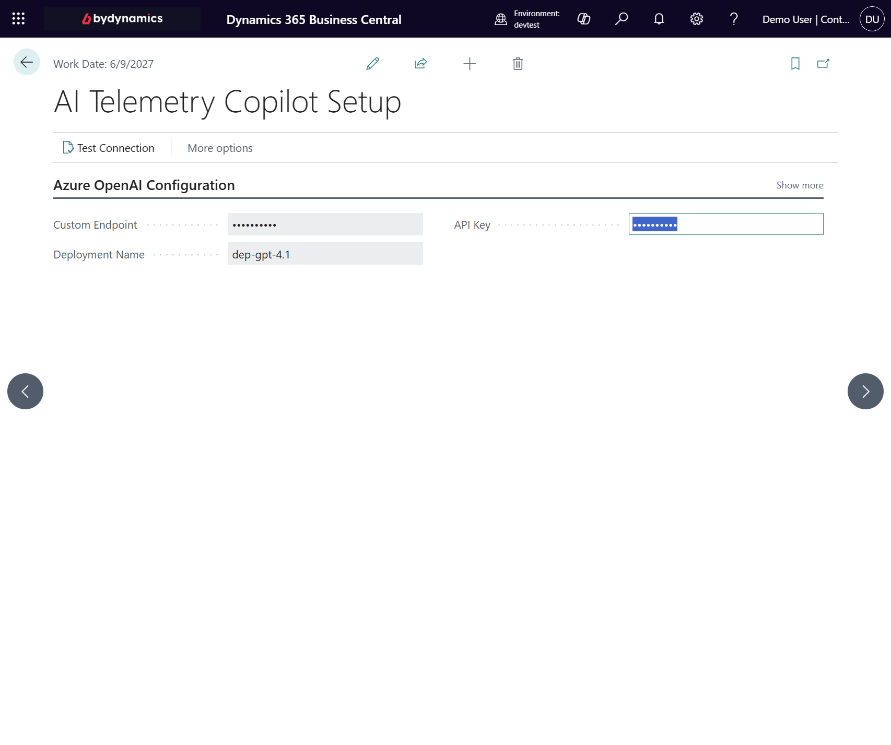

---

## 3. Permission Sets

| Permission Set | Description | Grants |
|----------------|-------------|--------|
| **AI Telemetry - Read** | View queries and results | Read access to all tables; execute queries |
| **AI Telemetry - Edit** | Full query management | Includes Read + create/edit/delete queries, manage setup |
| **AI Telemetry Copilot** | Use Copilot features | Access to Copilot generation and refinement |
| **AI Telem Copilot Adm** | Copilot administration | Includes AI Telemetry Copilot + configure custom AOAI settings |

Assign these via **Permission Sets** in Business Central, or use the **Setup Wizard** (Step 5 — User Permissions) to assign roles directly to users. Users need at minimum **AI Telemetry - Read** + **AI Telemetry Copilot** to use the app with Copilot.

---

## 4. Telemetry Queries

### 4.1 The Query List

Search for **Telemetry Queries** to open the main list. This shows all saved queries with:

| Column | Description |
|--------|-------------|
| Code | Unique identifier (e.g., `EXT-LIFECYCLE`) |
| Description | What the query shows |
| Active | Whether the query can be executed |
| Category | Grouping for organization |
| Usage Count | Number of times executed |
| Last Used Date Time | Most recent execution |

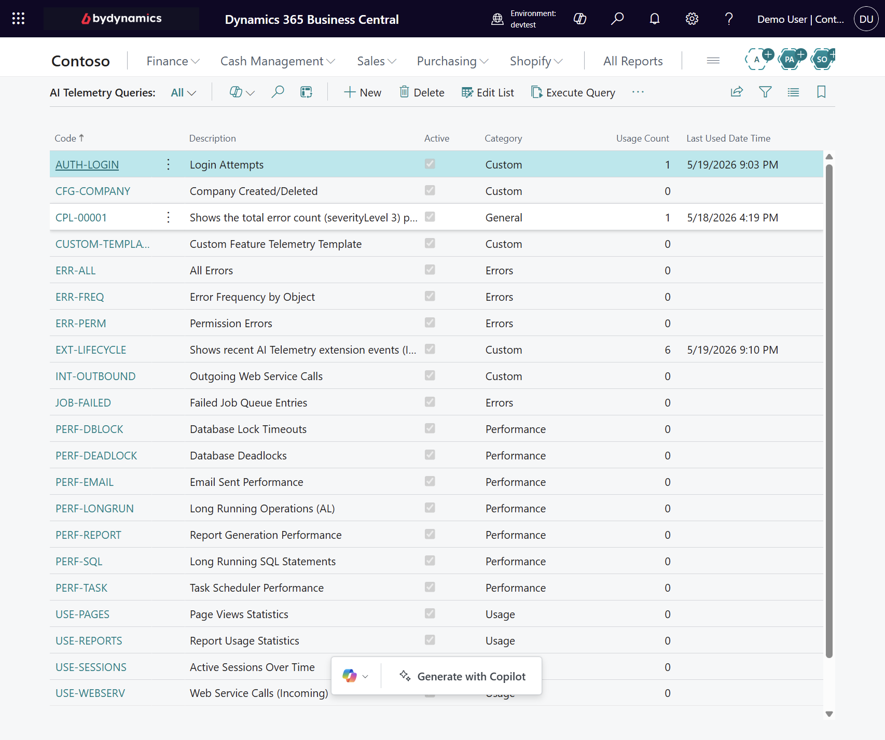

### 4.2 Query Categories

Queries are organized into categories:

| Category | Purpose |
|----------|---------|
| General | Multi-purpose or uncategorized queries |
| Errors | Error analysis, exceptions, failures |
| Performance | Slow operations, SQL stats, durations |
| Patterns | Recurring patterns and trends |
| Events | Specific telemetry event IDs |
| Usage | User activity, page views, API calls |
| Custom | User-created custom queries |

### 4.3 Creating a New Query

1. On the Telemetry Queries list, choose **+ New**.
2. Enter a **Code** (uppercase, max 20 characters — e.g., `MY-ERRORS`).
3. Enter a **Description**.
4. Select a **Category**.
5. Write your KQL in the editor (see 4.4).
6. The query is automatically saved and set to Active.

### 4.4 The Query Card & KQL Editor

The Query Card provides a code editor with:

- **KQL syntax highlighting** — keywords, operators, and strings are color-coded.
- **Format Query** action — auto-indents pipe-based KQL for readability.
- **Multi-line editing** — full code editor experience.

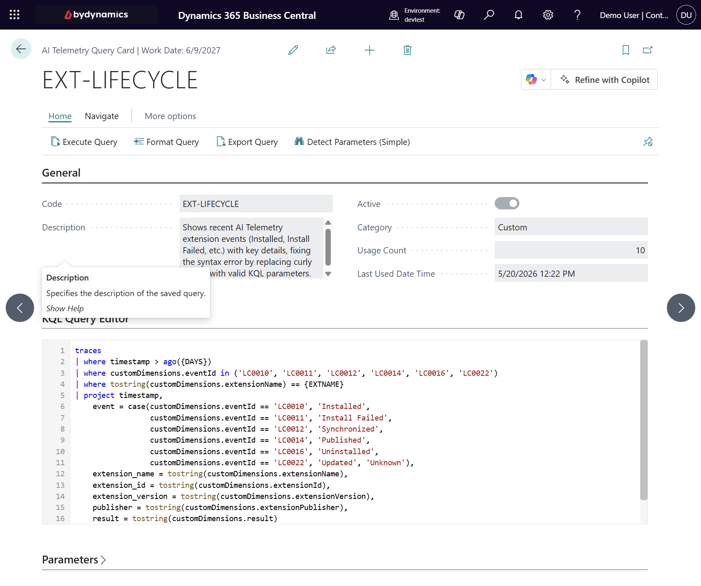

**Writing KQL:**

```kql
traces
| where timestamp > ago(7d)
| where severityLevel == 3
| summarize count() by tostring(customDimensions.eventId)
| order by count_ desc
| take 20
```

Use `{PARAMETER_NAME}` placeholders for parameterized values (see [Section 7](#7-query-parameters)).

### 4.5 Activating and Deactivating Queries

Toggle the **Active** field on the Query Card. Only active queries can be executed. Deactivating a query preserves it in the library without allowing accidental execution.

---

## 5. Executing Queries

### 5.1 Running a Simple Query

**From the list:** Select a query → click **Execute Query** in the action bar.

**From the card:** Open the query → click **Execute Query**.

If the query has no parameters, it runs immediately and opens the results page. If the query uses parameters, the **Execute AI Telemetry Query** page opens so you can review and fill in values before running.

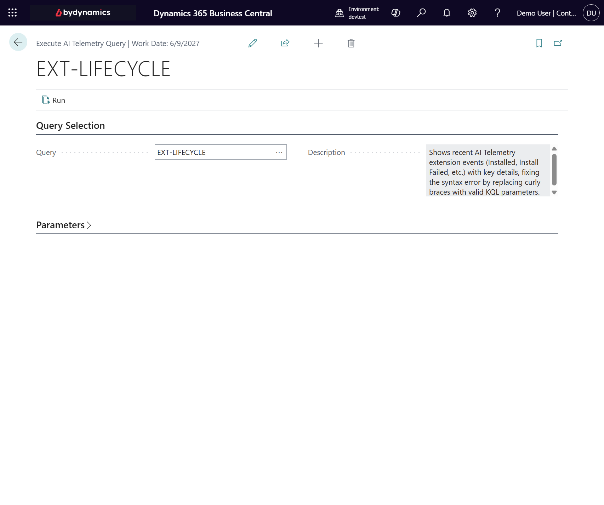

### 5.2 Running a Parameterized Query

If the query contains parameters (e.g., `{DAYS}`, `{EXTENSIONNAME}`), the **Execute Telemetry Query** page opens:

1. The query description is shown at the top.
2. Fill in the parameter values in the list below.
3. Use the lookup (…) button for parameters with predefined values.
4. Click **Run** to execute.

**Example:** The EXT-LIFECYCLE template uses `{DAYS}` for the time range, `{EXTENSIONNAME}` for the extension filter, and `{MAXROWS}` for result limiting. Default values are pre-populated so you can run immediately or adjust as needed.

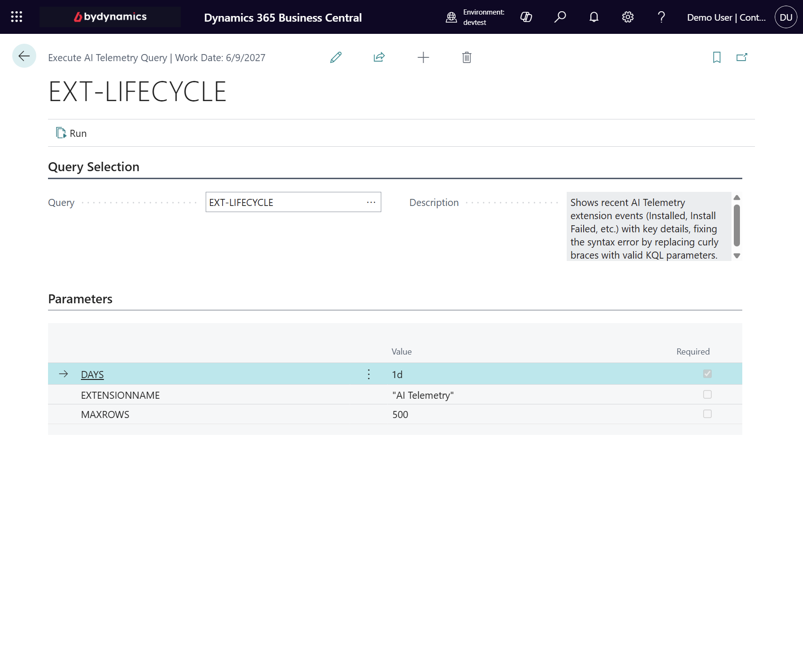

**Notes:**
- Required parameters must be filled before execution.
- Parameters with default values are pre-populated.
- Fixed parameters are hidden — they use their default value automatically.

---

## 6. Query Results

### 6.1 Results Grid

Results display in a dynamic grid with up to 20 columns. Column headers are auto-detected from the KQL output schema.

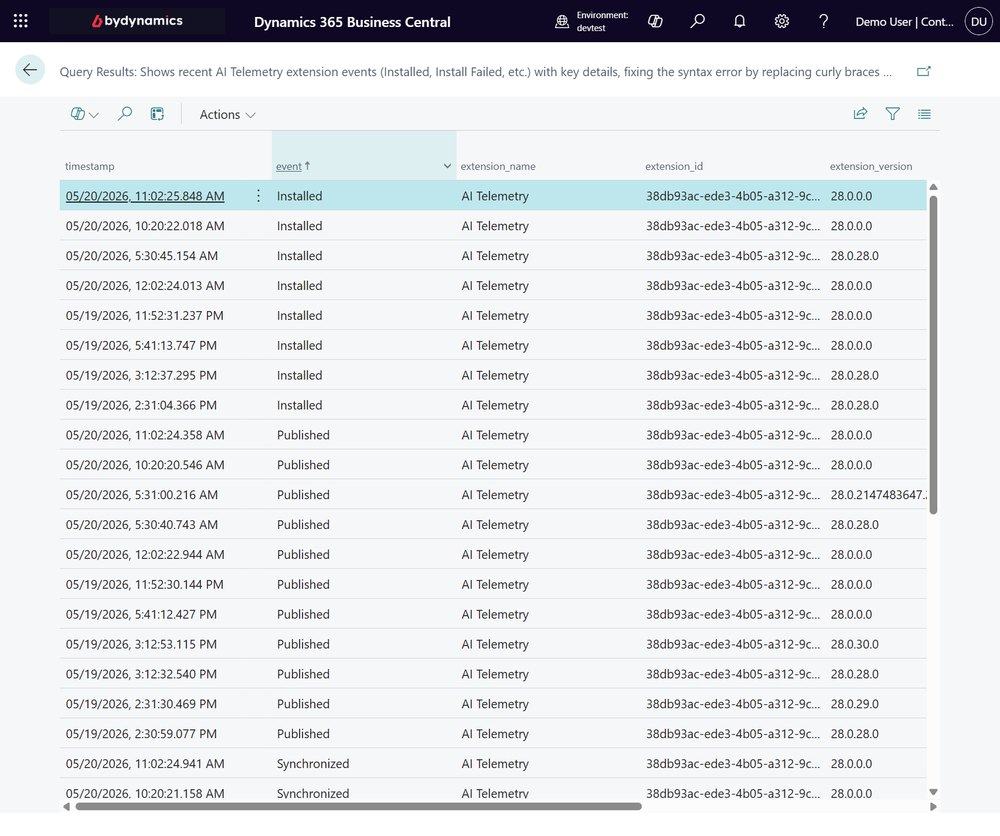

- Columns with no data are automatically hidden.
- The maximum number of rows displayed is controlled by the **Max Result Rows** setting (default: 1,000).

### 6.2 Viewing Row Details

Select a row and choose **Actions** → **View Details** to see the full JSON data for that record. This is useful when column data is truncated in the grid.

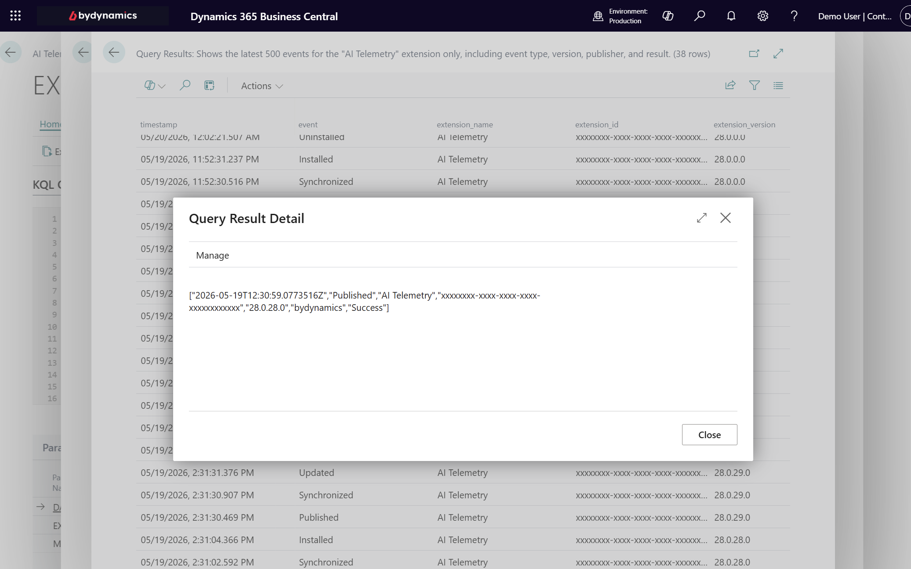

### 6.3 Open in Azure Portal

When query results contain a `runResourceId` column (typically from Logic App telemetry), the **Open in Azure Portal** action becomes available. It builds a direct deep-link to the specific Logic App run in the Azure Portal.

---

## 7. Query Parameters

Parameters turn static queries into reusable templates. Users provide values at execution time without editing the KQL directly.

### 7.1 Defining Parameters

On the Query Card, the **Parameter Definitions** section lists all parameters:

| Field | Description |
|-------|-------------|
| Parameter Name | The placeholder name used in KQL as `{PARAMETER_NAME}` |
| Display Name | User-friendly name shown during execution |
| Data Type | Text, Integer, Date, DateTime, or Boolean |
| Default Value | Pre-populated value (optional) |
| Required | Whether the user must provide a value |
| Fixed | Hidden parameter that always uses its default |
| Sequence No. | Display order during execution |
| Help Text | Guidance shown to the user |
| Lookup Type | None (free text) or Custom List |

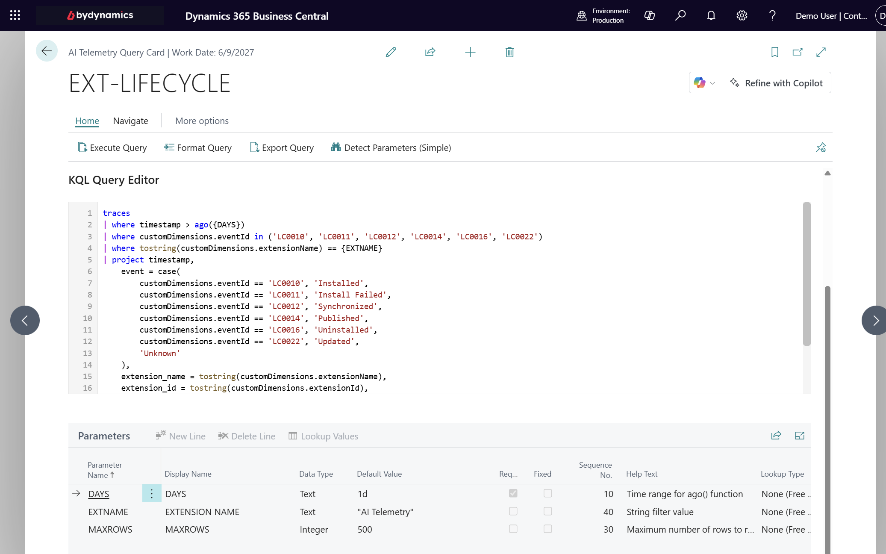

### 7.2 Parameter Data Types

| Type | Input Format | Example |
|------|-------------|---------|
| Text | Free text | `AI Telemetry` |
| Integer | Whole number | `7` |
| Date | Date picker | `2026-05-19` |
| DateTime | DateTime picker | `2026-05-19T14:30:00Z` |
| Boolean | Toggle | `true` / `false` |

### 7.3 Lookup Values

For parameters with **Lookup Type = Custom List**, you can define a set of allowed values:

1. In the Parameter Definitions list, click **Lookup Values**.
2. Add value/description pairs (e.g., `Production` / `Production environment`).
3. Set **Allow Manual Entry** = No to restrict users to predefined values only.

Lookup values can be **global** (available across all queries with matching parameter names) or **query-specific**.

### 7.4 Fixed Parameters

A **Fixed** parameter is hidden from the user during execution. It always uses its default value. Use cases:

- Hardcoding an environment name or tenant ID into a shared query.
- Setting a standard time range for a dashboard-style query.

### 7.5 Detecting Parameters Automatically

**Simple detection (pattern-based):**
Click **Detect Parameters (Simple)** on the Query Card. The app scans the KQL for `{PLACEHOLDER}` patterns and creates parameter definitions for any that don't already exist.

**AI detection (Copilot):**
Click **Detect Parameters (AI)** to have Copilot analyze the KQL and suggest values that could be parameterized (e.g., hardcoded time ranges, extension names, event IDs). A review page lets you accept or reject each suggestion. See [11.4 AI Parameter Detection](#114-ai-parameter-detection) for a detailed walkthrough.

---

## 8. Query Templates

### 8.1 Initializing Templates

On the Telemetry Queries list, click **Initialize Templates** to load pre-built queries. This creates standard queries covering common telemetry analysis scenarios. Existing queries with the same code are not overwritten.

### 8.2 Available Templates

Templates cover categories including:

- **Errors**: Recent errors, errors by extension, error frequency trends
- **Performance**: Long-running operations, SQL statistics, report generation times
- **Events**: Extension lifecycle (install/update/uninstall), authorization events
- **Usage**: Web service calls, API usage, user sessions

Each template is ready to execute immediately and serves as a learning example for KQL.

---

## 9. Import & Export

### 9.1 Exporting Queries

Export queries as JSON files for sharing across environments or with colleagues:

- **Export Selected**: Select one or more queries in the list → **Export Selected**.
- **Export All**: Exports the entire query library.

The JSON file includes the KQL query, parameter definitions, and lookup values.

### 9.2 Importing Queries

Click **Import** on the Telemetry Queries list and select a JSON file. Imported queries are added to the library. If a query with the same code already exists, it is updated.

---

## 10. Query Execution Log

### 10.1 Viewing the Log

Every query execution is logged. Access the log via:

- **From the Query Card**: Click **Query Log** to see executions for that specific query.
- **Search**: Search for **Telemetry Query Log Entry** to see all executions.

The log shows:

| Column | Description |
|--------|-------------|
| Entry No. | Sequential identifier |
| Query Code | Which query was executed |
| Execution Time | Timestamp of execution |
| Executed By | User who ran the query |
| Success | Whether the query succeeded |
| Result Count | Number of rows returned |
| Error Message | Error details (if failed) |

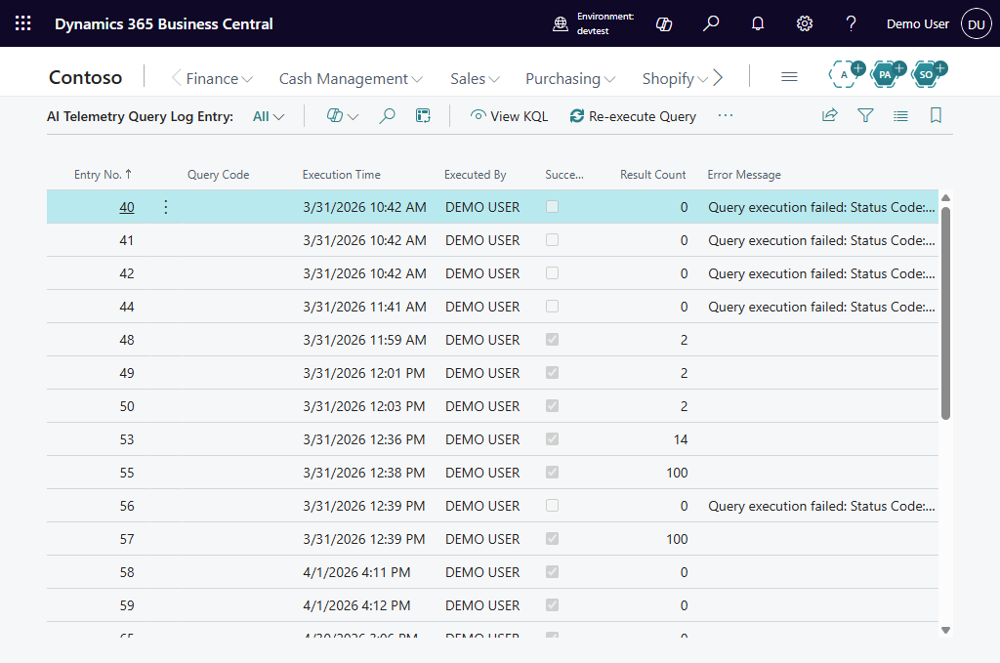

### 10.2 Re-executing from the Log

Select a log entry and choose **Re-execute Query** to run the exact same KQL again. This is useful for retrying failed queries or checking if an issue has been resolved.

You can also choose **View KQL** to inspect the exact query that was executed (including substituted parameter values).

---

## 11. Copilot - AI-Powered Query Generation

### 11.1 Prerequisites

- Business Central Online (SaaS) — Copilot is not available on-premises.
- Copilot & AI capabilities enabled in the Admin Center.
- The **AI Telemetry Copilot** permission set assigned to the user.
- For sandbox: a custom Azure OpenAI deployment configured (see [2.5](#25-copilot-setup-optional)).

### 11.2 Generating a New Query

1. On the Telemetry Queries list, click **Generate with Copilot**.
2. The Copilot dialog opens with a text input field.
3. Describe what you want to analyze in natural language. Examples:
   - *"Show me all errors from the last 7 days grouped by error message"*
   - *"Find the slowest web service calls this month"*
   - *"List extension installs and uninstalls for the AI Telemetry extension"*
4. Click **Generate**.
5. Review the generated KQL in the code editor.
6. Click **Use Query** to accept, **Regenerate** for a different approach, or **Discard** to cancel.

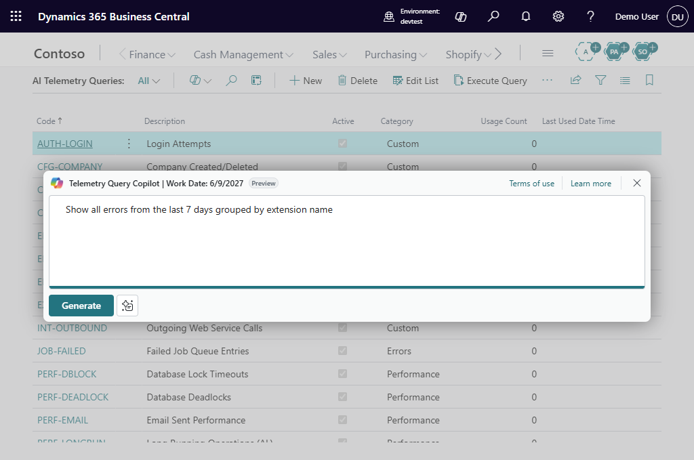

The accepted query is automatically saved with a generated code (e.g., `CPL-00001`) and opens on the Query Card for further editing.

### 11.3 Refining an Existing Query

1. Open a Query Card that already has KQL content.
2. Click **Refine with Copilot**.
3. Describe the change you want. Examples:
   - *"Filter to only show the AI Telemetry extension"*
   - *"Add a time chart visualization by hour"*
   - *"Remove the environment filter"*
4. Copilot modifies the existing query based on your instruction.
5. Accept or discard the modification.

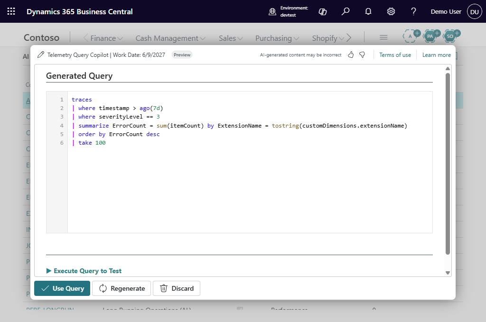

**Context awareness:** When refining, Copilot receives the current KQL and a sample of recent results (if available), allowing it to make targeted modifications.

### 11.4 AI Parameter Detection

1. On the Query Card, click **Detect Parameters (AI)** from the Copilot menu.
2. Copilot analyzes the KQL and identifies values that could be parameterized.
3. A review page shows each suggestion with:
   - Parameter name
   - Original hardcoded value
   - Suggested data type and default value
4. Check the parameters you want to create and click **Apply Parameters**.

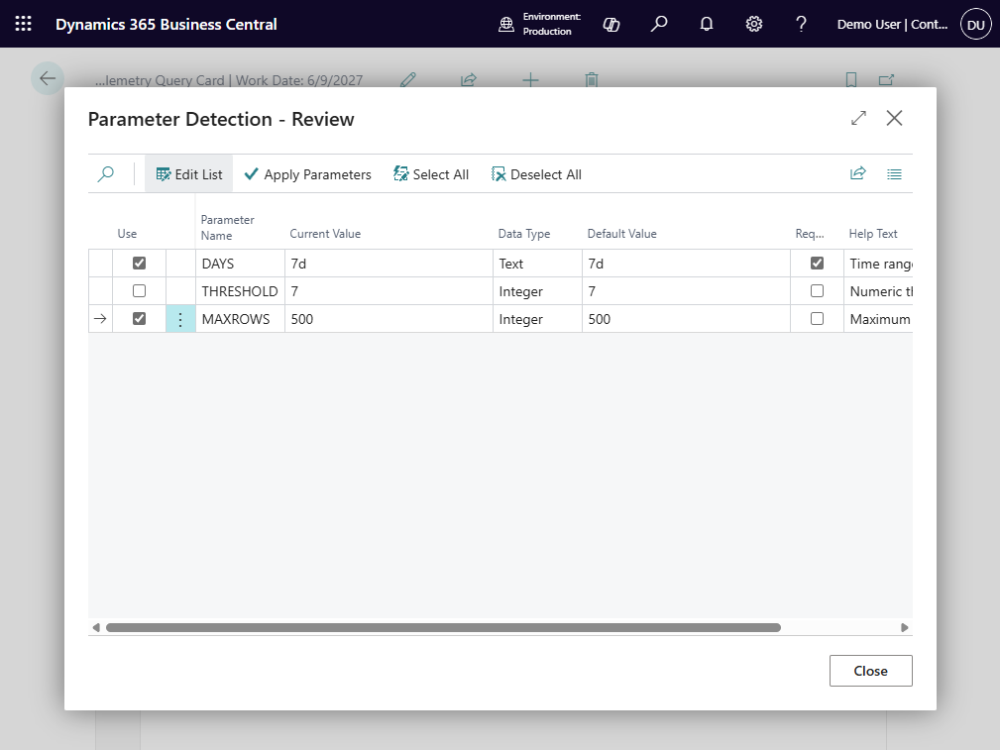

### 11.5 Prompt Guide

The Copilot dialog includes a **Prompt Guide** with example prompts. Click any example to populate the prompt field.

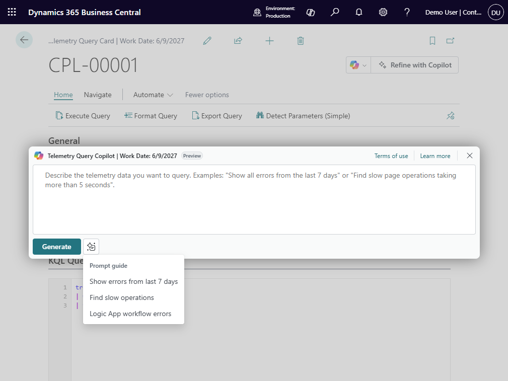

### 11.6 Self-Healing Queries

When Copilot generates a query, the app automatically test-executes it against Application Insights. If the query fails (syntax error, invalid column name, etc.), Copilot receives the error message and regenerates — up to 2 retry attempts. This significantly improves first-try success rates.

### 11.7 Custom Azure OpenAI Deployment

For sandbox environments or organizations that require their own AI infrastructure:

1. Search for **AI Telemetry Copilot Setup**.
2. Enter:
   - **Endpoint**: Your Azure OpenAI endpoint (e.g., `https://myorg.openai.azure.com/`)
   - **Deployment**: The model deployment name (e.g., `gpt-4o`)
   - **API Key**: Your Azure OpenAI API key
   - **Content Filter** (optional): A custom content filter policy name
3. Click **Test Connection** to verify.

When no custom endpoint is configured and the environment is production, the app uses Microsoft-managed Azure OpenAI resources automatically.

---

## 12. Troubleshooting

| Issue | Cause | Solution |
|-------|-------|----------|
| "Test connection failed" | Incorrect App ID or credentials | Verify the Application Insights App ID (not the Instrumentation Key). Check that the app registration has Reader access. |
| "Client Secret" error | Secret expired or not stored | Re-enter the Client Secret in Setup. Secrets are stored in Isolated Storage. |
| Empty results | Time range or filter too restrictive | Widen the `ago()` time range in your KQL. Check that your App Insights resource has data. |
| "Max Result Rows" reached | Query returns more data than the limit | Increase **Max Result Rows** in Setup (max 10,000) or add filters to the KQL. |
| Copilot not available | On-premises or Copilot disabled | Verify you are on BC Online (SaaS) and that Copilot is enabled in Admin Center. |
| "Sandbox requires custom deployment" | Microsoft-managed AOAI not available in sandbox | Configure a custom Azure OpenAI deployment in Copilot Setup. |
| Query fails after Copilot generation | Generated KQL has a syntax issue | The self-healing mechanism usually fixes this. If not, manually edit the KQL or regenerate. |
| "Failed to initialize Key Vault" | Key Vault not configured for the app | This is an internal error — contact bydynamics support. |

---

## 13. Reference

### 13.1 Pages Overview

| Page | Search Term | Purpose |
|------|-------------|---------|
| AI Telemetry Setup | `AI Telemetry Setup` | Configure Application Insights connection |
| Telemetry Queries | `Telemetry Queries` | Browse and manage saved queries |
| Telemetry Query Card | *(open from list)* | View/edit a single query with KQL editor |
| Execute Telemetry Query | *(triggered from actions)* | Enter parameter values and run a query |
| Telemetry Query Results | *(opens after execution)* | View query results in a dynamic grid |
| Telemetry Query Log Entry | `Telemetry Query Log` | View execution history |
| AI Telemetry Copilot Setup | `AI Telemetry Copilot Setup` | Configure custom Azure OpenAI deployment |

### 13.2 Keyboard Shortcuts

| Shortcut | Action |
|----------|--------|
| Alt+Q | Open search bar to find pages |
| Ctrl+Enter | Execute/submit on most dialog pages |
| F5 | Refresh current page |

---

*For support, contact [support@bydynamics.com](mailto:support@bydynamics.com) or visit [bydynamics AI Telemetry support](https://github.com/bydynamics/AL-AITelemetry-Support/blob/main/README.md).*
