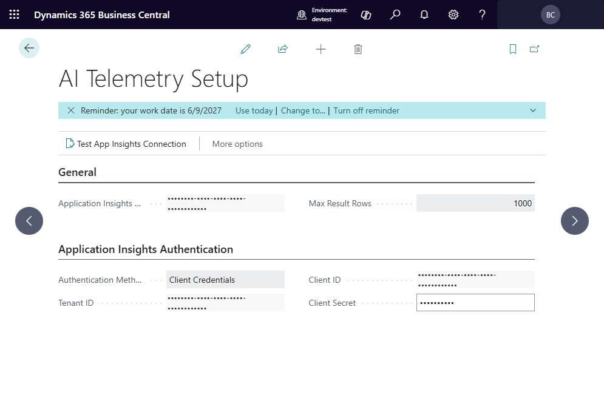

# Connecting to Application Insights

## Finding your Connection String

1. Sign in to the [Azure portal](https://portal.azure.com).
2. Navigate to your **Application Insights** resource.
3. On the *Overview* page, locate and copy the **Connection String**.

## Configuring the connection in Business Central

1. Search for **AI Telemetry Setup** and open the page.
2. Enter the **Application Insights App ID**.
3. Choose an **Authentication Method** (API Key or Client Credentials).
4. Fill in the required credentials for your chosen method.
5. Choose **Test App Insights Connection** to confirm the app can reach
   Application Insights.
6. If the test succeeds a confirmation message is shown.

## Multiple environments

If you use separate Application Insights resources per environment (production,
sandbox, etc.), repeat the setup in each environment with the corresponding
connection string.

## Security notes

- The connection string is stored encrypted in Business Central.
- Only users with the appropriate permission set can view or modify the setup.

---

[← Back to index](index.md) | [Next: Running a telemetry query →](RunningATelemetryQuery.md)
