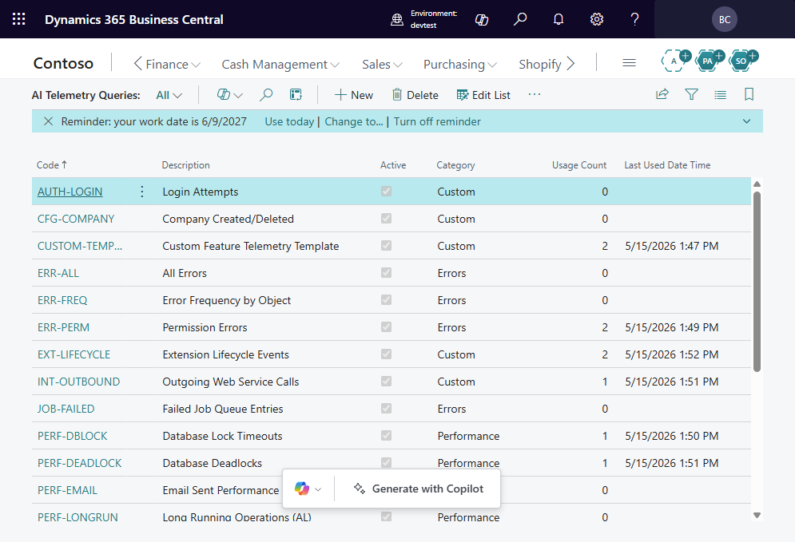
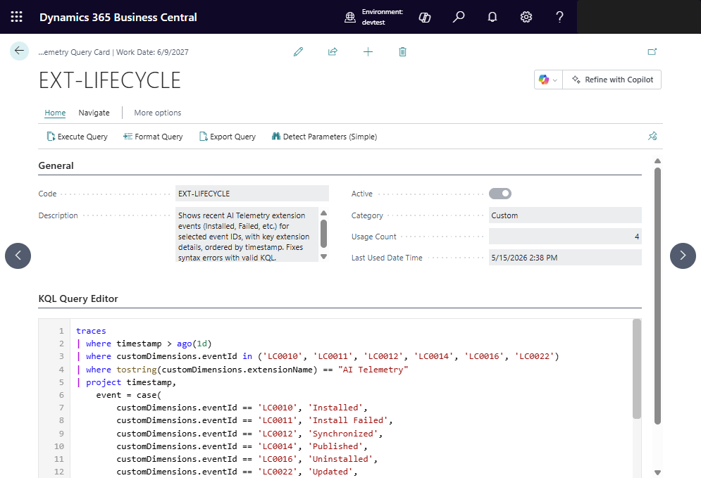

# Running a Telemetry Query

## From the Query List

1. Open **Telemetry Queries** from the search bar.
2. Select an existing query or create a new one.
3. Choose **Execute** to run the query against Application Insights.
4. Results appear on the **Telemetry Query Results** page.

## From the Query Card

1. Open a query card by selecting a query from the list.
2. Review or edit the KQL in the editor.
3. Choose **Execute Query** from the action bar.

## Using the KQL Editor

The built-in KQL editor provides:

- Syntax highlighting for KQL.
- A full-screen editing experience.
- The ability to paste queries copied from Azure Data Explorer or the Azure
  portal.

## Query timeouts

Queries are subject to the Application Insights API timeout. For complex queries
that span large time ranges, consider narrowing the time window or simplifying
the query.

---

[← Back to index](index.md) | [Next: Using Copilot to generate queries →](UsingCopilotToGenerateQueries.md)
