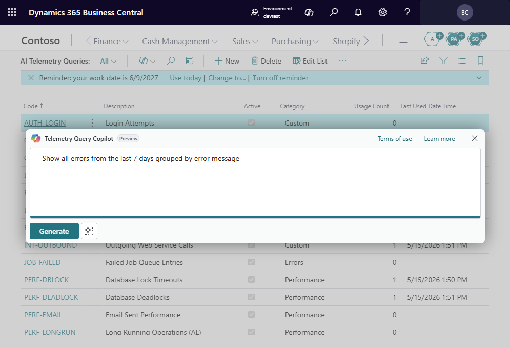
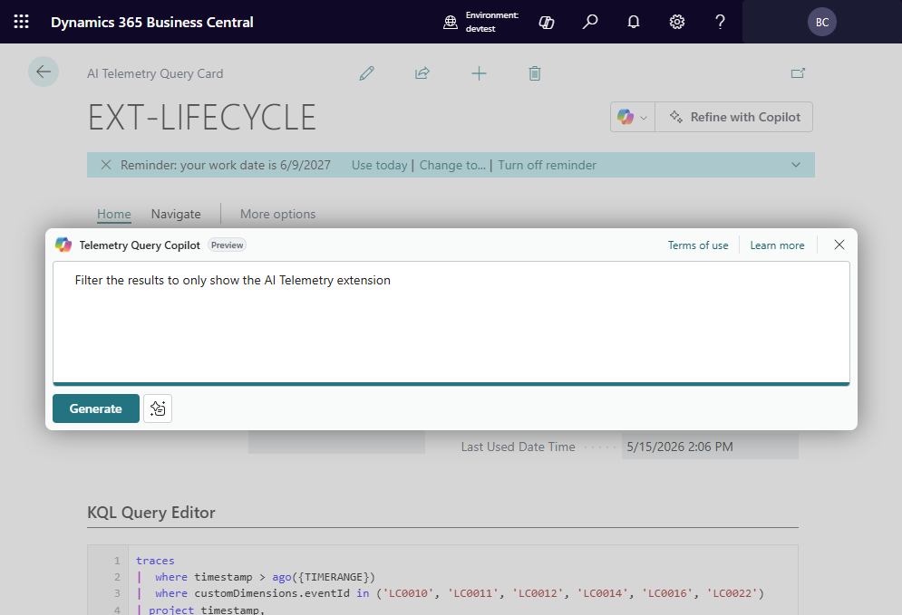
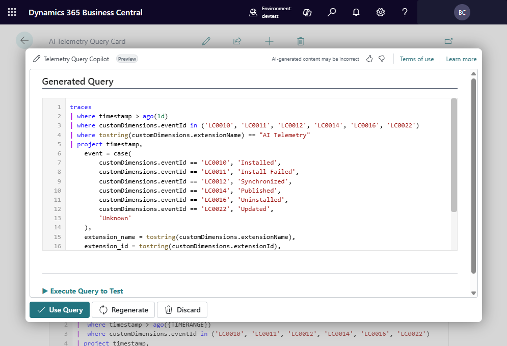

# Using Copilot to Generate Queries

## Overview

AI Telemetry integrates with Business Central's Copilot capabilities to let you
describe what telemetry data you need in plain language. Copilot then generates
the corresponding KQL query.

## How to use it

1. Open the **Telemetry Query Copilot** page (or choose the Copilot action from
   the Query Card).
2. Type a natural language prompt, for example:
   - *"Show me all failed web service calls in the last 7 days"*
   - *"List the top 10 slowest AL method calls"*
   - *"Count login events grouped by user"*
3. Copilot generates a KQL query based on the Business Central telemetry schema.
4. Review the generated query — edit if needed.
5. Choose **Accept** to save it as a new query, or **Execute** to run it
   directly.

You can also refine an existing query by describing what to change:

Copilot modifies the KQL and shows you the result:

## Tips for better results

- Be specific about time ranges (*"last 24 hours"*, *"this week"*).
- Mention the telemetry table if you know it (*traces*, *customEvents*).
- Include filters you need (*"for company Cronus"*, *"environment Production"*).

> **Note:** Copilot-generated queries can be incorrect or incomplete. Always review and validate the query results.

## Requirements

- Copilot must be enabled in your Business Central environment.
- The AI Telemetry Copilot setup must be configured (see Getting Started).

---

[← Back to index](index.md) | [Next: Managing saved queries →](ManagingSavedQueries.md)
