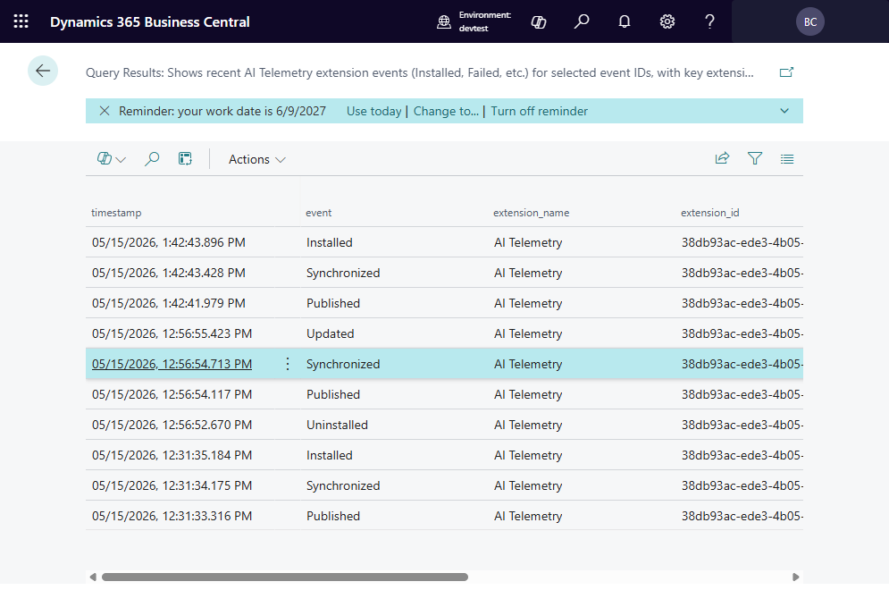

# Viewing Query Results

## Results grid

After executing a query, results are displayed in the **Telemetry Query Results**
page as a structured grid with columns matching the query output.

## Result detail

Select a row and choose **View Detail** to see the full record in a readable
format. This is useful for inspecting large text fields or JSON payloads that
don't fit in the grid columns.

## Exporting results

Results can be copied or further analysed by selecting rows in the grid.

## Query log

Every query execution is logged. Open the **Telemetry Query Log** to see:

- When the query was run.
- Who ran it.
- Whether it succeeded or failed.
- The execution duration.

---

[← Back to index](index.md) | [Next: Troubleshooting →](Troubleshooting.md)
